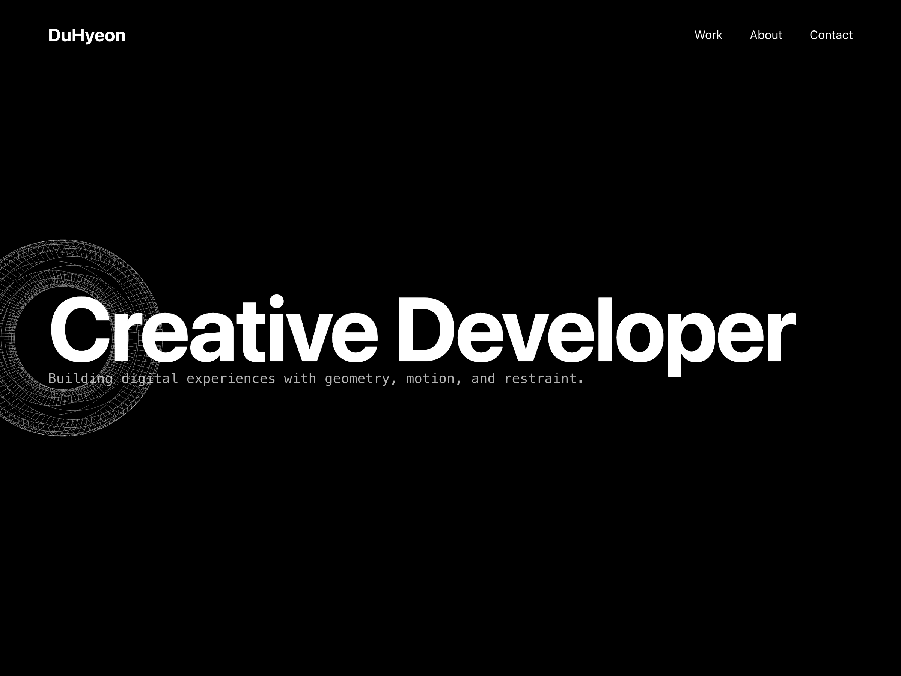

# Minimal 3D Portfolio

Swiss/Brutalist, ultra-minimal portfolio with Three.js and GSAP ScrollTrigger. Lateral torus motion tied to scroll, single accent color, smooth interactions with Lenis.

## Preview

> Screenshots are stored under `assets/screenshots/`.

<p>
  
  
</p>

## Features

- Geometry-first visuals: Torus-only scene, alternating white/accent edges
- Scroll-driven lateral motion with per-object randomness (phase, speed, spin, float)
- Smooth page and anchor scrolling (Lenis; native fallback)
- Cascading reveal animations (GSAP ScrollTrigger) for content
- Mobile-aware performance (reduced counts, pixel ratio caps)

## Tech Stack

- Three.js (scene/rendering)
- GSAP + ScrollTrigger (scroll orchestration)
- Lenis (smooth scrolling)

## Project Structure

- `index.html` — entry point (CDNs only; no build step)
- `assets/css/style.css` — site styles
- `assets/css/config.css` — typography variables
- `assets/scss/` — SCSS sources (optional, no build wired)
- `assets/js/main.js` — Three.js/GSAP/Lenis setup and animations
- `assets/screenshots/` — screenshots referenced in this README

## Run Locally

Open `index.html` directly in your browser, or serve statically:

```bash
python3 -m http.server 8080
# then open http://localhost:8080
```

## Deploy (GitHub Pages)

1) Push this repository to GitHub
2) Repository → Settings → Pages
3) Source: Deploy from a branch → Branch: `main` / Folder: `/ (root)` → Save
4) Visit `https://<username>.github.io/<repo>/`

## Editing Notes

- Colors: keep a single accent color via CSS variables in `:root`
- Performance: mind `count`, `verticalSpacing`, and pixel ratio caps for mobile
- If you edit SCSS, copy the result to `assets/css/style.css` (no build wired)

## License

MIT


